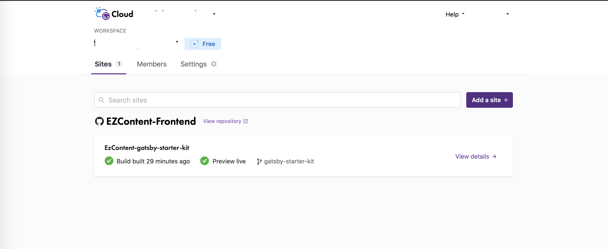
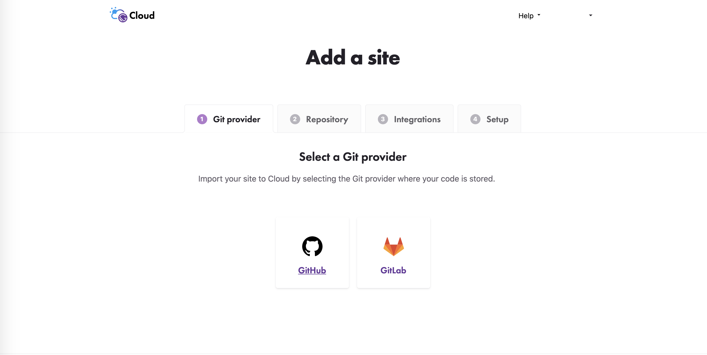
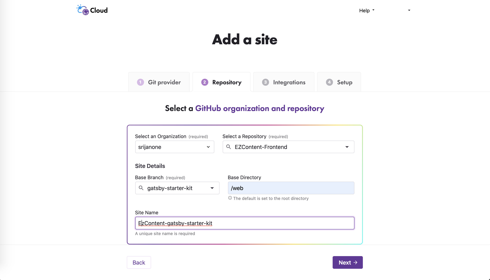
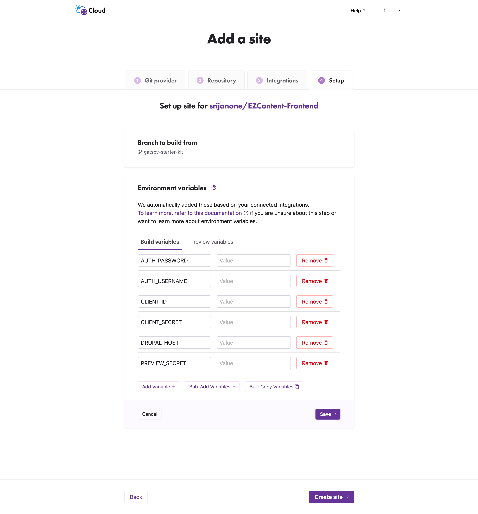

# About EZContent
<a href="https://www.drupal.org/project/ezcontent"><strong>EZContent</strong></a>  Open Source, full-featured Drupal Distribution with many content management features out of the box, including rich content, content staging and AI/ML assisted workflows

<strong>Create and Publish content easily</strong>

Build an SEO friendly, structured content model using flexible fields, meta tags, scheme.org and large library of components (rich text, multimedia etc).

<strong>Powerful Landing Page Builder</strong>

Editors can create page layouts on the fly, without dependency on developers. With the layout builder, editors can drag and drop reusable components onto pages.

<strong>Decoupled CMS and API Ready</strong>

Retain non-negotiable CMS features such as drag & drop page builder and content preview even in a de-coupled CMS implementation.

<strong>AI powered content generation</strong>

Be one step ahead with AI and ML-based auto-tagging, content generation, and personalized content.

## Prerequisite

If you are running the EzContent drupal application and the gatsby starter kit on your local system, please make sure you create a Virtual Host for your drupal application and pass it in the .env file updating the API_HOST.

## Getting Started/Setup

<strong><a href="https://www.drupal.org/project/ezcontent">EZContent</a></strong> and <strong><a href="https://www.drupal.org/project/ezcontent_api">EZContent API</a></strong> should be installed/setup to make this decoupled code working. 

If you have <strong>EZContent</strong> already up and running, then follow these steps.

## Host EzContent Gatsby Starterkit on Gatsby Cloud.

To host you site on Gatsby Cloud login to https://www.gatsbyjs.com/ and follow the steps mentioned below.

### Step 1
Click on add a site.

### Step 2
Import your code from Github or Gitlab provider.

### Step 3
Select the Github/Gitlab organisation and repository and update the Base Directory where the code is present.

### Step 4
Add Buid and Preview Enviroment Varibles required to communicate with the backend and click on Create Site.

### Your site will be up and ready!
